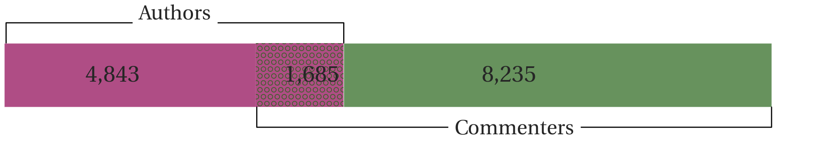

# CoFE - **Co**llaboration in **F**inancial **E**conomics

# What is this?
I have collected acknowledgement sections from all research papers published between 1997 and 2011 in the following six journals: The Journal of Finance, The Review of Financial Studies, Journal of Financial Economics, Journal of Financial Intermediation, Journal of Money, Credit & Banking, Journal of Banking and Finance.

The data contain consolidated and hand-checked information on 14,531 researchers:



We used it to construct and study the network of informal collaboration:


You can explore interactively at [michael-e-rose.github.io/CoFE](http://michael-e-rose.github.io/CoFE).

# Where do I find information?
The data, how we collected it and what it can be used for, is described in detail in Rose, Michael E. and Georg, Co-Pierre (2021): "What 5,000 Acknowledgements Tell Us About Informal Collaboration in Financial Economics", <i>Research Policy</i> 50(6) ([PDF](https://www.sciencedirect.com/science/article/abs/pii/S0048733321000408))
When using this data, please cite the article.

# How do I use this?
The file you're after is [`acks_min.json`](acks_min.json).

In Python, you can get the most recent version of the data like so
```python
from json import loads
from urllib.request import urlopen

COFE = 'https://raw.githubusercontent.com/Michael-E-Rose/CoFE/master/acks_min.json'

acks = loads(urlopen(COFE).read().decode("utf-8"))['data']
```

`acks` is a list of dictionaries (entries explained below).  You can iterate over the items to generate a network with networkx:
```python
from itertools import product

import networkx as nx

G = nx.Graph()
for item in acks:
    # Authors
    auths = [a['label'] for a in item['authors']]
    G.add_nodes_from(coms)
    # Commenters
    coms = [c['label'] for c in item.get('com', [])]
    G.add_nodes_from(coms)
    # Links
    links = list(product(coms, auths))
    G.add_edges_from(links)
```

## Filelist

* [`acks.json`](acks.json) is a hierarchically organized json file listing all information we have for each article (see variable list below).  The primary is key is always the title of the article.
* [`acks_min.json`](acks_min.json) is a minimized version of `acks.json` (no idents and superfluous blanks).
* [`consolidate_acks.py`](consolidate_acks.py) generates above two files using data in folder [`data`](data).

## Variables

* `title` (string): The title as stated in the pdf
* `prev` (list of strings): Titles of previous versions of the research article
* `journal` (string): Short version of the journal the article was published in
* `year` (integer): The publication year
* `auth` (list of dictionaries): Scopus ID or name of Author
* `editor` (string): Name(s) of specifically acknowledged editors
* `ref` (integer or list of dictionaries): Names or numbers of acknowledged referees
* `com` (integer or list of dictionaries): Names or numbers of commenters, that are not specifically acknowledged referees, discussants, editors or phd commitee members
* `dis` (integer or list of dictionaries): Names or numbers of specifically thanked discussants
* `ind` (integer or list of strings): Number or names of industry professionals (Note: Not every volume has been screened for this information)
* `ra` (integer or list of strings): Number of or names of specifically thanked research assitants (Note: Not every volume has been screened for this information)
* `con` (integer or list of strings): Names or number of conferences the article was presented
* `sem` (integer or list of strings): Names or number of universities, (central) banks, institutes, etc. where the article has been presented
* `jel` (list of strings): Listed [JEL-Codes](https://www.aeaweb.org/jel/guide/jel.php) as stated in the pdf
* `jel3` (list of strings): Listed JEL-Codes as stated on other sources (previous working papers, SSRN version, etc.)
* `data` (list of strings): Names of persons that provided data (Note: Not every volume has been screened for this information)
* `misc` (list of strings): Miscellaneous information collected, e.g. Prices won
* `ord` (list of strings): The ordering of categories within the entire acknowledgment section (Note: Not every volume has been screened for this information)

### Information for authors include
* `name` (string): The name in upper-case of the researcher as stated in the paper
* `scopus_id` (string): The ID of the researcher's profile in the Scopus database
* `label` (string): The display name of the researcher's profile in the Scopus database
* `corresponding` (boolean): True if author is corresponding author (Note: Not every volume has been screened for this information)
* `aff` (list of strings): Standardized affiliations of author as stated in the pdf
* `fund` (list of strings): Funding sources of the author received
* `phd` (list of strings): Names of author's specifically acknowledged PhD committee members
* `vis` (list of strings): Standardized affilations the author visited during publiction
* `former` (list of strings): Previous standardized affilations of the author

### Information for com, dis, phd, editor include
* `name` (string): The name in upper-case of the researcher as stated in the paper
* `scopus_id` (string): The ID of the researcher's profile in the Scopus database - not available everywhere
* `label` (string): The standardized name of the researcher, which is the display name of the researcher's profile in the Scopus database if `scopus_id` is present, and a standardized version of `name` otherwise
